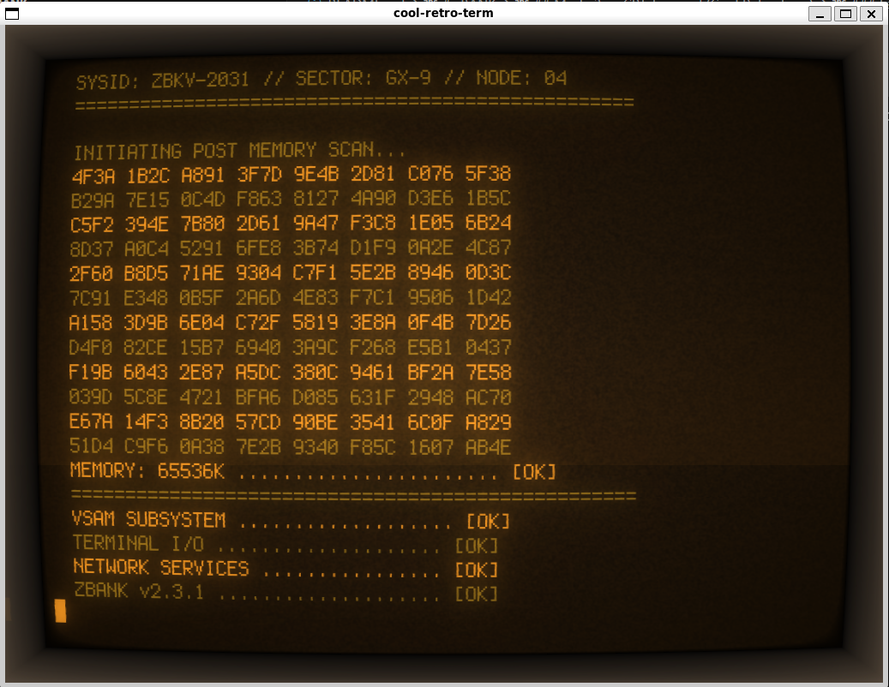
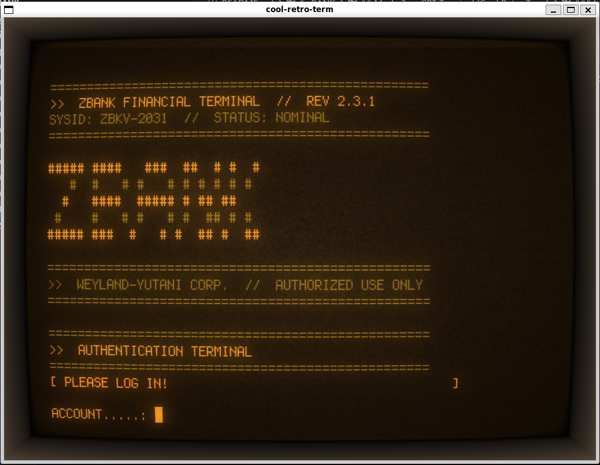
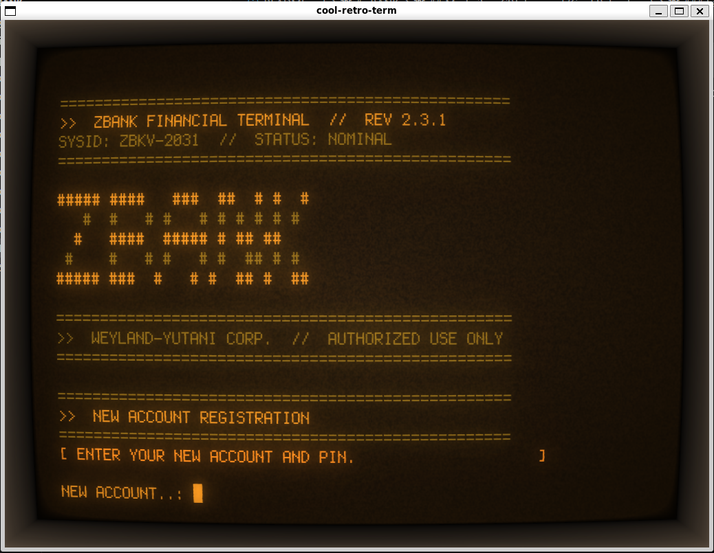
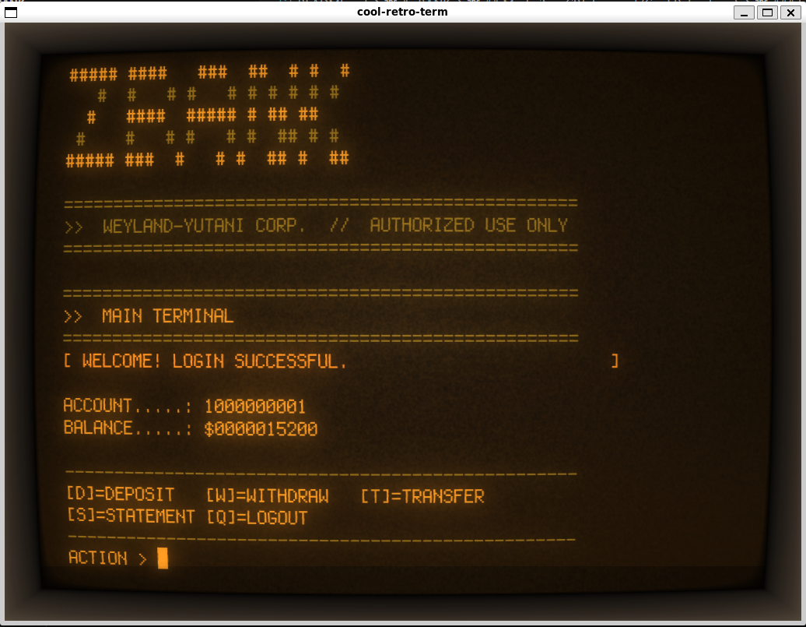
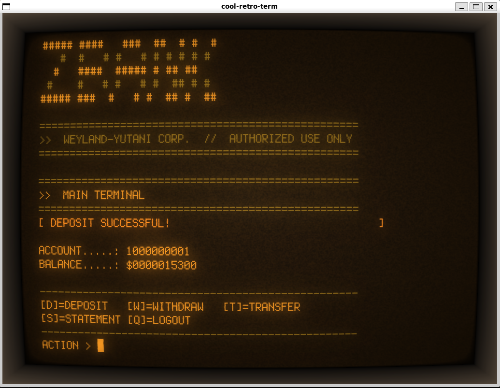
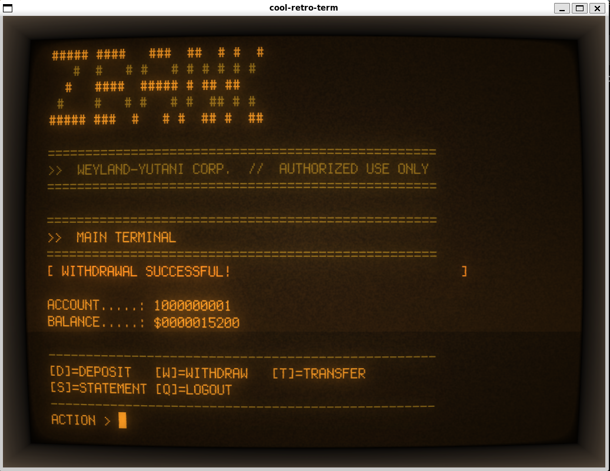
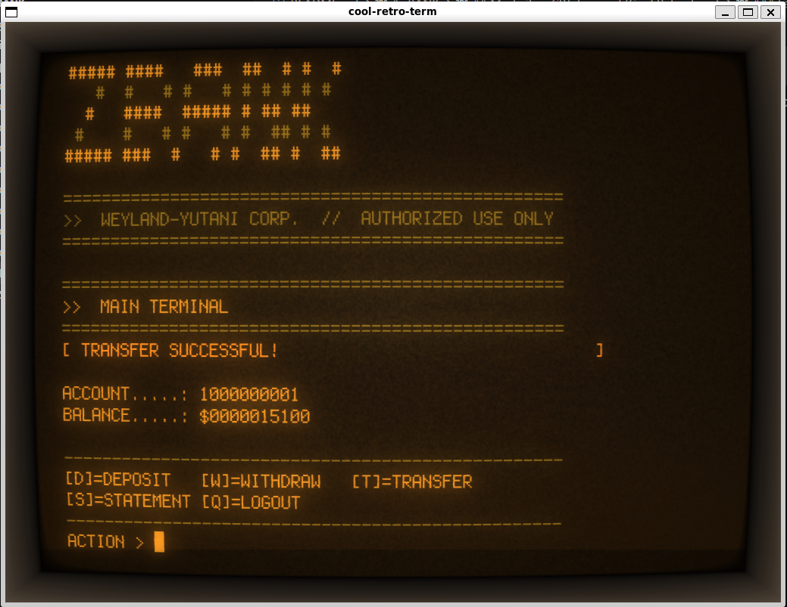
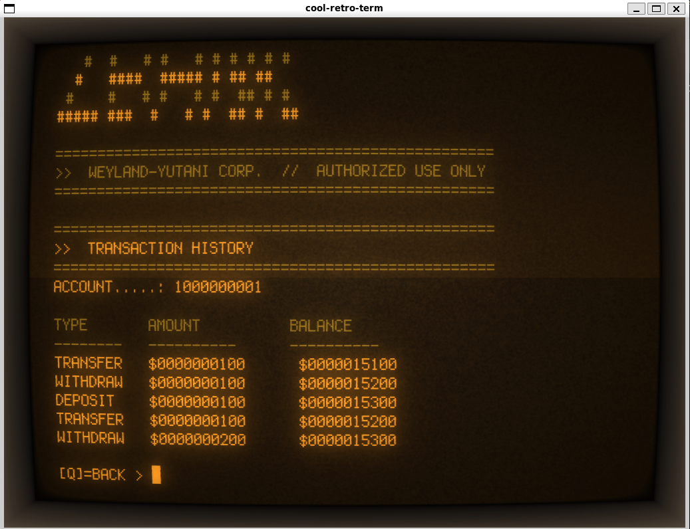
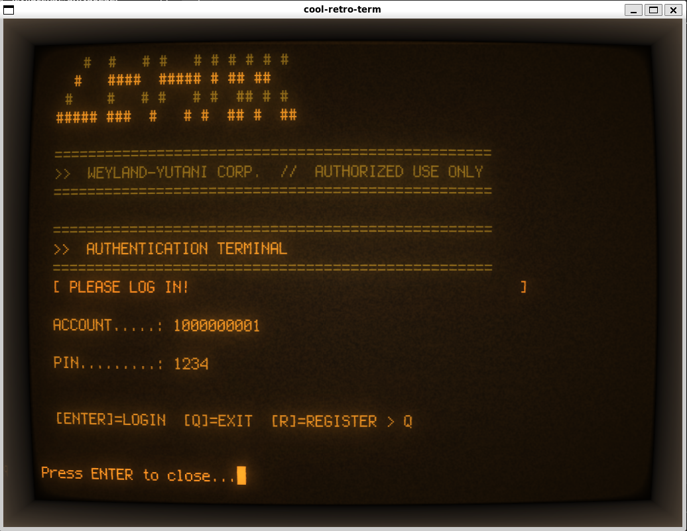

# zBANK

    

COBOL program to simulate a bank account balance, utilizing a VSAM file as a persistent storage.

COBOL application using CICS, BMS and VSAM.

<span> **An Enterprise Mainframe Computing Project**</span>

*Authors:*\
Benjamin Linnik\
Nicklas V.\
Henrik G.


For the lecture Enterprise Mainframe Computing a project was developed
in collaboration. The project named "ZBANK" is an application written in
COBOL and uses CICS as a transaction monitor, BMS as a user interface
and a key-sequenced VSAM for data storage. In this document, we
summarize the program code and the work done.


Schematic sketch of the functional structure of ZBANK

---

## Overview

zBANK simulates a complete bank account system: login with PIN lockout, deposit, withdraw, transfer between accounts, account registration, and transaction history. The project preserves the original mainframe architecture while providing modern alternatives to run and study the code without mainframe infrastructure.

| Mode | Language | Runtime | Status |
|------|----------|---------|--------|
| Mainframe | COBOL / CICS / BMS / VSAM | IBM z/OS | Original |
| Terminal | COBOL / GnuCOBOL | WSL 2 + Ubuntu | **Working** |
| Terminal CRT | COBOL / GnuCOBOL + Cool Retro Term | WSL 2 + Ubuntu | **Working** |

---

## Project Structure

```
zBANK/
│
├── CICS.COB_ZBANK3_.cbl       ← Main program — screen controller (CICS)
├── CICS.COB_ZBNKAUTH_.cbl     ← Authentication subprogram (CICS)
├── CICS.COB_ZBNKTXN_.cbl      ← Transaction subprogram (CICS)
├── CICS.JCL_ZMAPSET_.cbl      ← BMS screen definitions (4 screens)
├── CICS.JCL_VSAMSET_.cbl      ← Account VSAM cluster definition
├── CICS.JCL_VSAMTX_.cbl       ← Transaction history VSAM definition
├── CICS.JCL_PPCOMLNK_.cbl     ← Compile and link JCL
├── CICS.JCL_COPY2VSM_.cbl     ← Load sequential data into VSAM
├── CICS_install.cbl            ← CEDA installation commands
├── SEQDAT.ZBANK.cbl            ← Sample sequential data (demo accounts)
│
├── gnucobol/
│   ├── ZBNKBANK.cbl            ← Main program (DISPLAY/ACCEPT terminal)
│   ├── ZBNKAUTH.cbl            ← Authentication subprogram (CALL)
│   ├── ZBNKTXN.cbl             ← Transaction subprogram (indexed file I/O)
│   ├── ZBCOLOR.cpy             ← ANSI color codes copybook (green CRT palette)
│   ├── SEED.cbl                ← Creates demo accounts in data files
│   ├── compile.sh              ← Build script
│   ├── launch-crt.sh           ← Launcher: Cool Retro Term + zBANK
│   ├── test_bank.exp           ← Automated test script (expect)
│   ├── sounds/                 ← Startup and beep audio files
│   ├── ZBNKBANK.dat            ← Account data file (created by seed)
│   └── ZBNKBANKTX.dat          ← Transaction history file (created at runtime)
│
└── img/
    ├── logo.png
    ├── ZBankSetup.png
    ├── Loading.png
    ├── login.png
    ├── register.png
    ├── menu.png
    ├── deposit.png
    ├── withdraw.png
    ├── transfer.png
    ├── statement.png
    └── logout.png
```

---

## Mode 1 — Mainframe (COBOL / CICS / VSAM)

The original implementation. Requires IBM z/OS with CICS, BMS, and VSAM.

### Architecture

```
3270 Terminal
     │
     ▼
CICS Transaction (ZBNK)
     │
     ├─► ZBNKBANK  ← main screen controller
     │       ├─► ZBNKAUTH  (EXEC CICS LINK — authentication)
     │       └─► ZBNKTXN   (EXEC CICS LINK — transactions)
     │
     ├─► VSAM VSAMZBNK    (accounts, 37 bytes, key 10)
     └─► VSAM VSAMZBTX    (tx history, 36 bytes, key 15)
```

### BMS Screens (Mapset: ZBANKSET)

| Map | Description | Actions |
|-----|-------------|---------|
| CBLOGIN | Login | Q=Quit, R=Register, ENTER=Login |
| CBHOME | Home / balance | Q=Logout, D=Deposit, W=Withdraw, T=Transfer, S=Statement |
| CBREG | Account registration | Q=Back, C=Create |
| CBSTMT | Statement — last 5 transactions | Q=Back |

### VSAM Record Layout

**Account file (VSAMZBNK) — 37 bytes:**
```
WS-ACCNO    PIC 9(10)   ← indexed key
WS-PIN      PIC 9(10)
WS-BALANCE  PIC 9(10)
WS-ATTEMPTS PIC 9(1)    ← failed login counter (locks at 3)
WS-LOCKED   PIC 9(1)    ← 0=open, 1=locked
WS-TXCOUNT  PIC 9(5)    ← transaction sequence counter
```

**Transaction history file (VSAMZBTX) — 36 bytes:**
```
TX-ACCNO    PIC 9(10)   ← key part 1
TX-SEQNO    PIC 9(5)    ← key part 2
TX-TYPE     PIC X(1)    ← D=Deposit W=Withdraw T=Transfer
TX-AMOUNT   PIC 9(10)
TX-BALANCE  PIC 9(10)
```

### CICS Installation

```
CEDA DEFINE MAPSET(ZBANKSET)   GROUP(ZBANK)
CEDA DEFINE TRANSACTION(ZBNK)  PROGRAM(ZBNKBANK) GROUP(ZBANK)
CEDA DEFINE PROGRAM(ZBNKBANK)  GROUP(ZBANK)
CEDA DEFINE PROGRAM(ZBNKAUTH)  GROUP(ZBANK)
CEDA DEFINE PROGRAM(ZBNKTXN)   GROUP(ZBANK)
CEDA DEFINE FILE(VSAMZBNK)     GROUP(ZBANK) DSNAME(U0210.VSAM.ZBANK)
CEDA DEFINE FILE(VSAMZBTX)     GROUP(ZBANK) DSNAME(U0210.VSAM.ZBANKTX)
```

See [CICS_install.cbl](CICS_install.cbl) for the full set of CEDA commands.

### COBOL Code
[CICS.COB_ZBANK3_.cbl](CICS.COB_ZBANK3_.cbl) — Main screen controller\
[CICS.COB_ZBNKAUTH_.cbl](CICS.COB_ZBNKAUTH_.cbl) — Authentication subprogram\
[CICS.COB_ZBNKTXN_.cbl](CICS.COB_ZBNKTXN_.cbl) — Transaction subprogram

### JCL CICS Submit Code
[CICS.JCL_PPCOMLNK_.cbl](CICS.JCL_PPCOMLNK_.cbl)\
[CICS.JCL_VSAMSET_.cbl](CICS.JCL_VSAMSET_.cbl)\
[CICS.JCL_VSAMTX_.cbl](CICS.JCL_VSAMTX_.cbl)\
[CICS.JCL_ZMAPSET_.cbl](CICS.JCL_ZMAPSET_.cbl)\
[CICS.JCL_COPY2VSM_.cbl](CICS.JCL_COPY2VSM_.cbl)

### Other files
[SEQDAT.ZBANK.cbl](SEQDAT.ZBANK.cbl)

### Improvements Over the Original zBANK

| # | Feature | Implementation |
|---|---------|---------------|
| 1 | Account registration | `WRITE` to VSAM with duplicate key detection (RESP code 16) |
| 2 | Transfer between accounts | Reads both accounts, validates balance, rewrites both |
| 3 | Bug fix — deposit zero | `IF AMOUNT > ZEROS` before `ADD` |
| 4 | Bug fix — overdraft | `IF AMOUNT <= WS-BALANCE` before `SUBTRACT` |
| 5 | Bug fix — withdraw zero | `IF AMOUNT > ZEROS` before `SUBTRACT` |
| 6 | Descriptive error messages | `EVALUATE` on RESP/result codes, no raw numeric output |
| 7 | Transaction history screen | CBSTMT reads VSAM with `STARTBR/READPREV/ENDBR` |
| 8 | PIN masking | `ATTRB=(UNPROT,NUM,NORM,DRK)` on all PIN fields |
| 9 | Login lockout | WS-ATTEMPTS counter, locks at 3 wrong PINs |
| 10 | Subprogram architecture | ZBNKAUTH + ZBNKTXN via `EXEC CICS LINK PROGRAM(...)` |

---

## Mode 2 — Terminal (GnuCOBOL / WSL)

Pure COBOL running on any Linux or WSL environment. Replaces CICS/BMS/VSAM with native COBOL terminal I/O and indexed files. No mainframe required.

The terminal UI features a retro green phosphor CRT aesthetic inspired by the Alien: Isolation Sevastopol station terminals — green-on-black ANSI colors, ASCII block art, and Weyland-Yutani corporate branding.

### CICS → GnuCOBOL Translation

| Mainframe | GnuCOBOL |
|-----------|----------|
| `EXEC CICS SEND MAP` | `DISPLAY` |
| `EXEC CICS RECEIVE MAP` | `ACCEPT` |
| `EXEC CICS READ/REWRITE DATASET` | `READ/REWRITE` on indexed file |
| `EXEC CICS WRITE DATASET` | `WRITE` on indexed file |
| `EXEC CICS LINK PROGRAM(...)` | `CALL 'subprogram' USING ...` |
| `EXEC CICS RETURN` | `GOBACK` / `STOP RUN` |
| `EXEC CICS STARTBR/READPREV/ENDBR` | `START/READ PREVIOUS` on indexed file |
| VSAM cluster | COBOL indexed file (`ORGANIZATION IS INDEXED`) |
| BMS screen colors | ANSI escape codes via `ZBCOLOR.cpy` copybook |

### Requirements

- Windows 11 with WSL 2
- Ubuntu 24.04 (via `wsl --install -d Ubuntu`)
- GnuCOBOL 3.1+ (via `sudo apt install gnucobol`)

### Setup (first time only)

```powershell
# 1. Install Ubuntu on WSL (PowerShell as Administrator)
wsl --install -d Ubuntu
```

```bash
# 2. Inside Ubuntu — install GnuCOBOL
sudo apt update && sudo apt install gnucobol -y

# 3. Go to the project folder
cd /mnt/c/Users/<your-user>/Documents/GitHub/zBANK/gnucobol

# 4. Compile all programs
chmod +x compile.sh && ./compile.sh

# 5. Create demo accounts (run once)
./seed
```

### Running

```bash
cd /mnt/c/Users/<your-user>/Documents/GitHub/zBANK/gnucobol
./zbank
```

### Stopping

To stop the application from inside: press `Q` on the login screen.

If the process is running in the background and needs to be force-killed:

```bash
# Find the process
pgrep -a zbank

# Kill it by PID
kill <PID>
```

### Terminal Interface

The terminal renders a full-screen Alien Isolation style UI with ANSI green phosphor colors:

```
  ==================================================
  >>  ZBANK FINANCIAL TERMINAL  //  REV 2.3.1
  SYSID: ZBKV-2031  //  STATUS: NOMINAL
  ==================================================

  ##### ####   ###  ##  # #  #
     #  #   # #   # # # # # #
    #   ####  ##### # ## ##
   #    #   # #   # #  ## # #
  ##### ###  #   # #  ## #  ##

  ==================================================
  >>  WEYLAND-YUTANI CORP.  //  AUTHORIZED USE ONLY
  ==================================================

  ==================================================
  >>  AUTHENTICATION TERMINAL
  ==================================================
  [ PLEASE LOG IN!                               ]

  ACCOUNT.....: _
  PIN.........: _

  [ENTER]=LOGIN  [Q]=EXIT  [R]=REGISTER >
```

### ANSI Color System (`ZBCOLOR.cpy`)

The `ZBCOLOR.cpy` copybook provides ANSI escape code variables used across all screens:

| Variable | Code | Color |
|----------|------|-------|
| `CB-BGREEN` | `ESC[92m` | Bright green — primary text |
| `CB-GREEN` | `ESC[32m` | Dark green — borders/separators |
| `CB-YELLOW` | `ESC[33m` | Amber — status bar messages |
| `CB-BG-BLK` | `ESC[40m` | Black background |
| `CB-RESET` | `ESC[0m` | Reset all attributes |

### Demo Accounts

| Account | PIN | Balance |
|---------|-----|---------|
| 1000000001 | 1234 | $15,000 |
| 1000000002 | 5678 | $3,200 |
| 1000000003 | 1111 | $87,450 |

### Compiled Binaries

| File | Description |
|------|-------------|
| `zbank` | Main executable |
| `ZBNKAUTH.so` | Authentication shared module |
| `ZBNKTXN.so` | Transaction shared module |
| `seed` | Demo data loader (run once) |
| `ZBNKBANK.dat` | Account indexed data file |
| `ZBNKBANKTX.dat` | Transaction history indexed file |

---

## Mode 3 — CRT Terminal (Cool Retro Term)

The most authentic Alien: Isolation experience. Runs the GnuCOBOL terminal inside **Cool Retro Term**, a terminal emulator that simulates a real CRT phosphor screen with scanlines, bloom, flicker, screen curvature, and chromatic aberration.

### Requirements

- WSL 2 + Ubuntu (same as Mode 2)
- GnuCOBOL installed and compiled (same as Mode 2)
- Cool Retro Term 1.2+ (installed via apt on Ubuntu)
- WSLg — built into Windows 11 WSL2, enables Linux GUI apps natively

### Install Cool Retro Term

```bash
# Inside Ubuntu (WSL2)
sudo apt update && sudo apt install cool-retro-term -y
```

### Launch

```bash
# Option 1 — using the provided launcher script
bash /mnt/c/Users/<your-user>/Documents/GitHub/zBANK/gnucobol/launch-crt.sh

# Option 2 — direct command (run from Ubuntu terminal)
DISPLAY=:0 cool-retro-term -e bash -c 'cd /mnt/c/Users/<your-user>/Documents/GitHub/zBANK/gnucobol && ./zbank; bash' &
```

### Recommended CRT Profile Settings (Sevastopol)

Configure via `Edit → Settings → Effects` in Cool Retro Term:

| Setting | Value | Effect |
|---------|-------|--------|
| **Color Scheme** | Green Phosphor | Classic CRT green #00FF41 |
| **Font** | Monospace 14 | Clean fixed-width |
| Bloom | 0.45 | Phosphor glow around text |
| Burn-in | 0.40 | Phosphor persistence / ghost trails |
| Scanlines | 0.30 | Horizontal CRT scan lines |
| Flickering | 0.04 | Subtle screen instability |
| Screen curvature | 0.12 | CRT barrel distortion |
| Jitter | 0.08 | Horizontal sync jitter |
| Chroma color | 0.15 | RGB chromatic aberration |
| Noise | 0.03 | Static noise overlay |

Save as profile: **Settings → Save profile → "Sevastopol"**

---

## Testing (GnuCOBOL Terminal Mode)

All core operations were verified using `expect`-based automated testing on Ubuntu 24.04 (WSL 2) with GnuCOBOL. Tests were run against demo account `1000000001` (PIN `1234`, initial balance $15,000).

### Test Results

| # | Operation | Input | Expected | Result | Final Balance |
|---|-----------|-------|----------|--------|---------------|
| 1 | Login | Account `1000000001`, PIN `1234` | `WELCOME! LOGIN SUCCESSFUL.` | ✅ Pass | $15,000 |
| 2 | Deposit | $500 | `DEPOSIT SUCCESSFUL!` | ✅ Pass | $15,500 |
| 3 | Withdraw | $200 | `WITHDRAWAL SUCCESSFUL!` | ✅ Pass | $15,300 |
| 4 | Transfer | $100 → account `1000000002` | `TRANSFER SUCCESSFUL!` | ✅ Pass | $15,200 |
| 5 | Statement | — | Last 3 transactions listed | ✅ Pass | — |
| 6 | Logout | Q | Returns to login screen | ✅ Pass | — |

### Running the Tests

```bash
# Prerequisites: expect installed
sudo apt install expect -y

# Reset demo accounts (required before each test run)
cd /mnt/c/Users/<your-user>/Documents/GitHub/zBANK/gnucobol
./seed

# Run automated test
expect test_bank.exp
```

---

## Original Mainframe Screens

Screenshots of the COBOL/CICS/BMS screens on a 3270 terminal:

|  |  |  |  |
|---|---|---|---|
| _Loading screen_ | _Login screen_ | _Register screen_ | _Home screen_ |
| _Deposit screen_ | _Withdraw screen_ | _Transfer screen_ | _Statement screen_ |
| _Logout screen_ |  |  |  |
